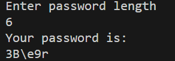

# Random-Password-Generator

A random password generator in Python is a tool that creates secure and unpredictable passwords using a mix of characters. It leverages the random and string modules to include uppercase letters, lowercase letters, numbers, and special characters. The program allows users to specify the desired password length for customization.

The password is generated by randomly selecting characters from the specified sets and shuffling them for additional randomness. It ensures strong, unique passwords suitable for online accounts or sensitive data protection. The script is lightweight, efficient, and easily extendable to add features like excluding ambiguous characters or enforcing specific rules. This project is ideal for learning randomization, string manipulation, and simple user interaction in Python.

# Example:

